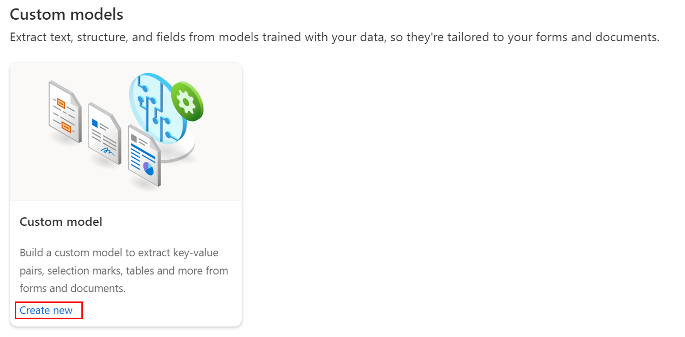
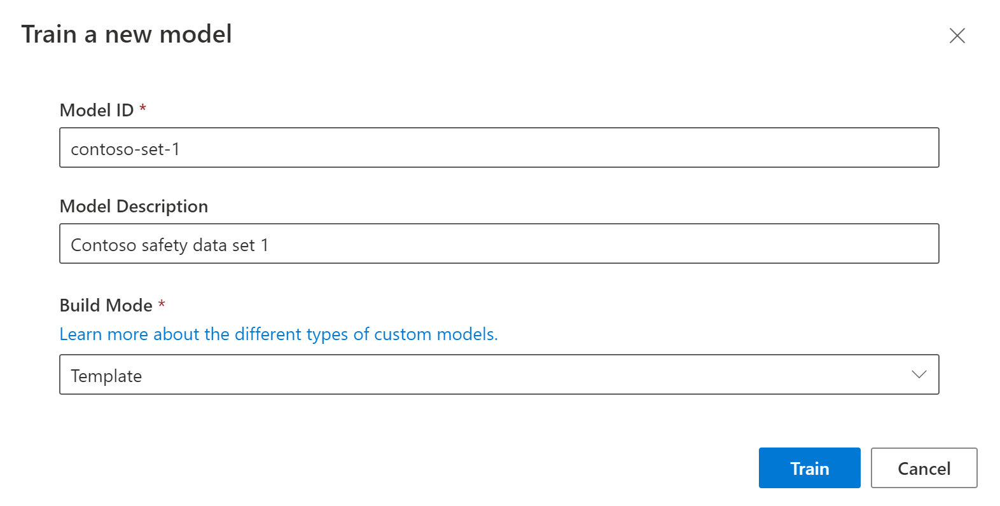

# Create Azure AI Document Intelligence Machine Learning Model 

Follow the steps below to train a Azure AI Document Intelligence custom extraction machine learning (ML) model. 

## Step 1: Locate the Sample Data Files

After finishing the deployment process described in [Deployment Scripts Guide](../1_deployment_scripts/README.md), your Document intelligence source should be ready for you to start creating a new Document Intelligence ML model. From your cloned repository, navigate to the project root directory then to `Deployment\Data\samples\train`

You will see two folders that contain sample training forms, as illustrated below.

## Step 2: Upload Sample Forms to Azure Data Lake Storage

1. Go to the [Azure Portal](https://portal.azure.com) and select the Azure Data Lake Storage Account that was created by deployment script. The name of this account should be <your-prefix>adls,<your-suffix>.
2. On the left side of the menu pane, select `Data storage`, then `Containers` and go to the `samples` container. 
3. Create a new folder and name it `train`.  
4. In the `train` folder, create two folders. One named `contoso_set_1` and the other named `contoso_set_2`.  
5. Upload the sample labeling files in [Data/samples/train/contoso_set_1](../Data/samples/train/contoso_set_1) and [Data/samples/train/contoso_set_2](../Data/samples/train/contoso_set_2)  into the corresponding folders. You now have two full sets of pre-labeled data to create the machine learning models.

### Step 3: Train and Merge Document Intelligence ML Models

In this step, you will train custom Azure AI Document intelligence customer extraction models and merge them into a composite model. For more information, please refer to Azure online document [Compose Custom Models](https://learn.microsoft.com/en-us/azure/ai-services/document-intelligence/how-to-guides/compose-custom-models?view=doc-intel-4.0.0&tabs=studio).

1. Go to [Document Intelligence Studio](https://documentintelligence.ai.azure.com/studio), scroll down to  `Custom Extraction Model` and select `Create new`, as illustrated below.

1. Select `+Create a project` to create a project.
1. Enter a project name. For example `SafetyFormProject-Set-1` or any other project name of your choice.
1. Enter a project description. For example `Custom form recognizer model with samples contoso_set_1` and click `Continue`.
1. Select your Subscription, Resource Group and the Document Intelligence resource.
1. Select the latest, non-preview API Version.
1. Now you will be prompted to enter the training data source, as illustrated below. Select your subscription. Select Resource Group, and Azure storage created by the deployment scripts. Enter `samples` in the Blob container field. Enter `train/contoso_set_1` in the Folder path field. Click `Continue`.

1. Review Information and click `Create Project`. This step connects the form recognizer studio to Azure data lake storage/container resource in your subscription to access the training data. 
1. After the project is created, forms with OCR, field key and value pair will appear as illustrated below. Click '`Train`' on upper right corner.

1. Fill in information as below, and select the dropdown "Build Mode" to `Template`, and then click `Train`. 

1. Once the training for `contoso_set_1` samples is done, the model will be located in `Models` tab with confidence score of each field, as illustrated below.

1. Train second model with files stored in `train/contoso_set_2`, using above steps to create a new project and model. Name your second model as `consoto-set-2` or choice of your own.
1. Click 'Models' from your project. You will see a list of models already created. You can now merge individual models into a composite model. Select `contoso-set-1` and `contoso-set-2`, then click `Compose`. The system will prompt you for a new model name and description. Enter `contoso-safety-forms` or choice of your own, with a description. Click `Compose`.

1. Now your model id `contoso-safety-forms` will appear in the Model ID list, as illustrated below. Please make a note of this composed model id as you will need it to set up the Azure Functions App to use this model id, as described in [Solution Configuration Guide](../3_solution_configuration/README.md). 

